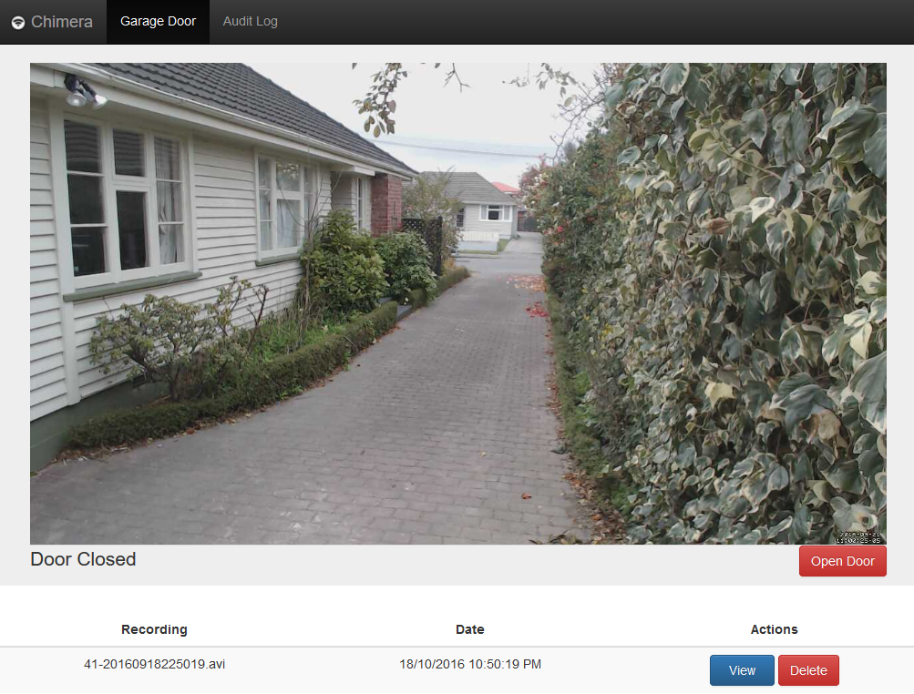
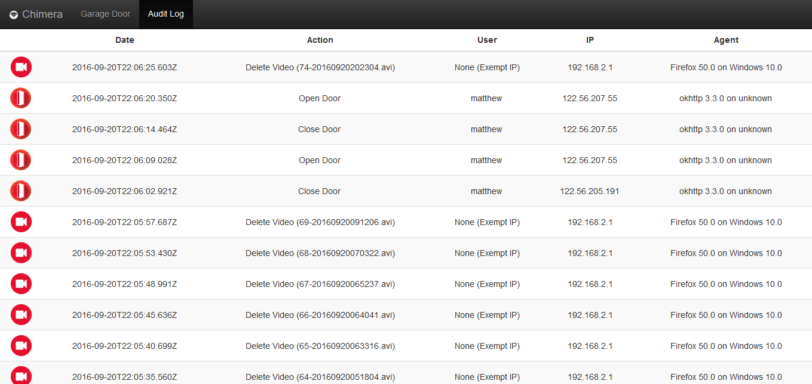
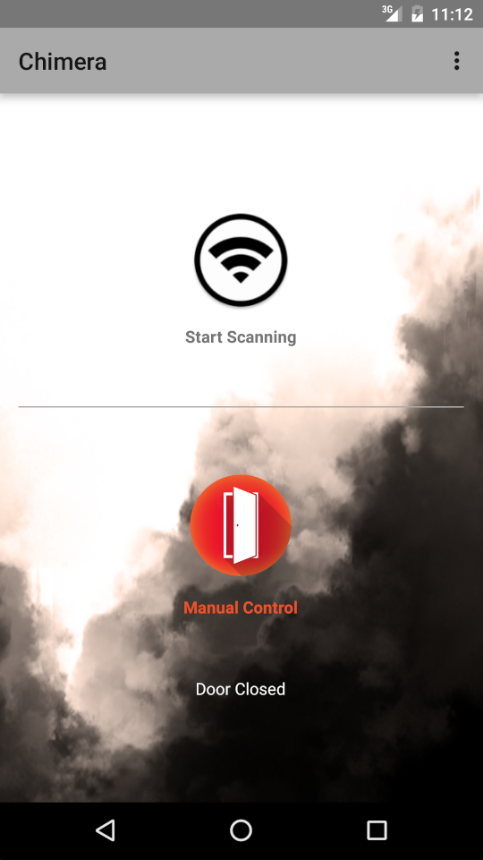

# Chimera
Garage Door control via a Node.JS web interface or an Android application. Using the Android app it can automatically open/close a garage door when approaching or leaving. The web interface links with Motion to provide management of security recordings and provides an access log for the garage door control. This has been designed for hosting on a Raspberry Pi.

## Server
### Installation
```shell
git clone https://github.com/mrkno/Chimera.git
cd Chimera/server
npm install
bower install

echo > config.json << EOF
{
    "videosDirectory": "/path/to/motion/recordings",
	"webcamFeed": "http://foo.bar.com/motionWebcamStream"
}
EOF

echo > users.json << EOF
[
	{
		"username": "foo",
		"password": "<sha512ed password>"
	}
]
EOF
```

## Android Client
Android client is an Android Studio project targeting Android Marshmellow. Configuration is possible through a built in settings menu.

## Screenshots
  
Door control UI (web server). Provides access to door control functions, live stream of door camera and recordings.

  
Audit UI (web server). Provides an audit log of who has opened, closed and deleted recordings. Exempt IPs are LAN addresses that do not require authentication to access the server functions (configurable in `config.json`).

  
Main mobile control UI (Android). The start scanning button will detect if you are leaving/arriving and auto-detect when to open/close the door as appropriate. Manual control can be used at any time to open/close the door. The menu in the top right gives access to the camera feed and settings.
